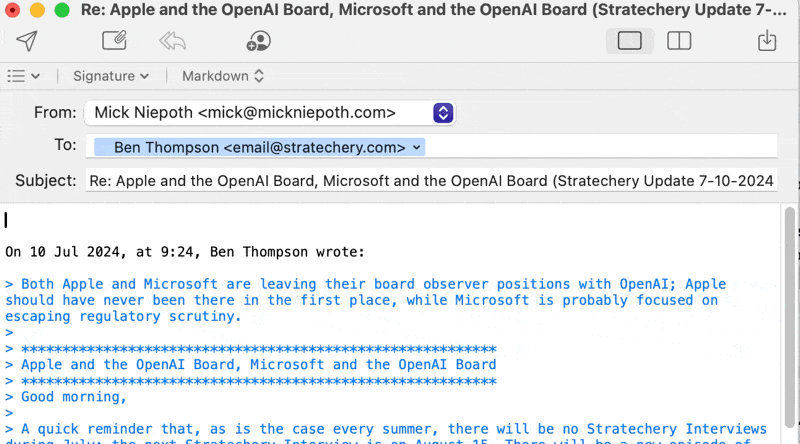

# MailMate GPT Assistant

This MailMate bundle integrates AI-powered email composition assistance into MailMate, supporting both Anthropic's Claude and OpenAI's GPT models.

## Features

- AI-assisted email drafts
- Support for both Anthropic and OpenAI APIs
- Customizable settings via configuration file
- Works with both plain text and HTML emails

## Demo



## Installation

1. Clone this repository into your MailMate bundles directory:
   ```
   git clone https://github.com/mickn/mailmate-ai-assistant.git ~/Library/Application\ Support/MailMate/Bundles/GPTAssistant.mmbundle
   ```

2. Edit the `config.ini` file in the bundle directory:
   - Set `ApiProvider` to either `anthropic` or `openai`
   - Add your API key to `ApiKey`
   - Optionally, change the `Model` if desired

3. Make the script executable:
   ```
   chmod +x ~/Library/Application\ Support/MailMate/Bundles/GPTAssistant.mmbundle/Support/bin/gpt_assist.py
   ```

4. Restart MailMate

## Usage

1. Draft an email. Either a new email, or a reply.
2. (Optional) Briefly type your response. E.g. 'What time?'
3. Use the keyboard shortcut Ctrl+C (or the command from the menu) to invoke the AI assistant.
4. The GPT will turn your draft into a full email.

***Due to limitations of Mailmate, it needs to create a new draft. If anyone knows any workarounds: please let me know!***

## Configuration

Edit the `config.ini` file to change settings:

- `ApiProvider`: Set to `anthropic` or `openai`
- `ApiKey`: Your API key for the chosen provider
- `Model`: The AI model to use (e.g., `claude-3-sonnet-20240229` for Anthropic or `gpt-3.5-turbo` for OpenAI)

## Debugging

If you encounter issues:

1. Check the log file at `/tmp/ai_assist.log` for error messages.
2. Ensure your API key is correct and has the necessary permissions.
3. Verify that the `config.ini` file is properly formatted and in the correct location.
4. Make sure the script has execution permissions.

## Contributing

Contributions are welcome! Please feel free to submit a Pull Request.

## License

This project is licensed under the MIT License - see the [LICENSE](LICENSE) file for details.
